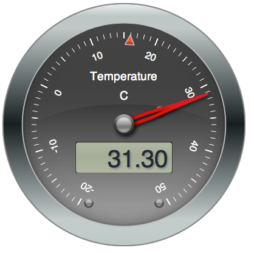

# tempgauge

Read a topic from MQTT and display the value on a gauge



## Websockets

This uses WSS which provides a WebSocket interface and connects to my MQTT broker:

```bash
WSS \
	--websocketPort 18883 \
	--brokerHost localhost \
	--brokerPort 1883
```

`boom.py` publishes a random temperature to my Mosquitto broker every 0.5s.

## Demo

See it and interact with it [here](http://test.mosquitto.org/gauge/)


## Credits

* Inspired by [Matthew Bordignon] (https://twitter.com/bordignon)
* [WSS](https://github.com/stylpen/WSS/tree/mqtt), a WebSocket to TCP Gateway for MQTT
* [Paho](http://www.eclipse.org/paho/) JavaScript [library](http://git.eclipse.org/c/paho/org.eclipse.paho.mqtt.javascript.git/)
* [Build your own Javascript MQTT Web Application](http://www.hivemq.com/build-javascript-mqtt-web-application/)
* [The HTML5 Canvas port of the SteelSeries component library](https://github.com/HanSolo/SteelSeries-Canvas)
* Thanks to Roger Light for setting up the test site.
